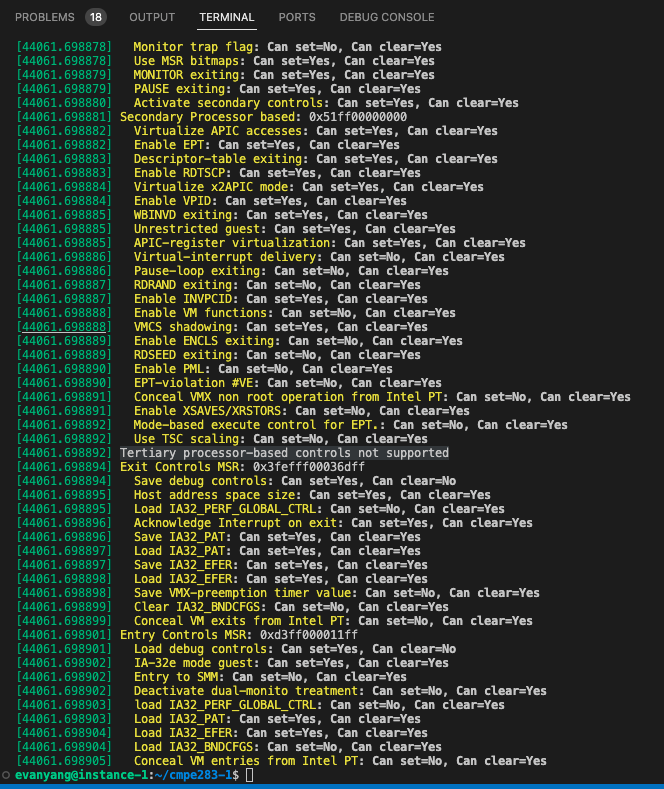

# CMPE 283 - assignment 1

## Questions

1. Members: Evan Yang, I'm doing this lab by myself
2. Describe in detail the steps
   1. Create a VM instance on [Google Cloud Platform](https://console.cloud.google.com/)
      - CPU: n2-standard-8
      - disk: 100G
      - add SSH key for later use

      ```bash
      ssh-keygen
      ```

      The key will be saved at `~/.ssh`
      
   2. After customizing the instance, click on `equivalent command line`
      - add `--enable-nested-virtualization`
      
   3. Set up `VS Code` remote ssh
      - set up your ~/.ssh/config
      
      - connect to instance via vs code
        - connect to Host  
        
        - choose the host you set  
        
        - voila  
        
   4. Install libraries that we need
      - update apt, apt-get

      ```bash
      sudo apt update
      sudo apt-get update
      ```

      - install gcc, linux kernel

      ```bash
      sudo apt install gcc, make
      sudo apt-get install linux-headers-$(uname -r)
      ```

   5. Set up includePath in vs code
      - here I'm using `/lib/modules/5.4.0-1092-gcp/build`, the same as `Makefile`
   6. check Intel SDM for controls
      - The specific tables are in the comment
      - [Intel SDM Vol.3](https://cdrdv2.intel.com/v1/dl/getContent/671447)
   7. create the `struct` for vm-execution control fields
   8. implement `detect_vmx_features` using `rdmsr`
   9. insert/remove the module, and dump the message
      - `insmod`, `rmmod`, `dmesg`

      ```bash
      sudo insmod ./cmpe283-1.ko
      sudo dmesg
      sudo rmmod cmpe283-1
      ```

      
   10. Check the message
      - [dmesg.log](dmesg.log)
      
